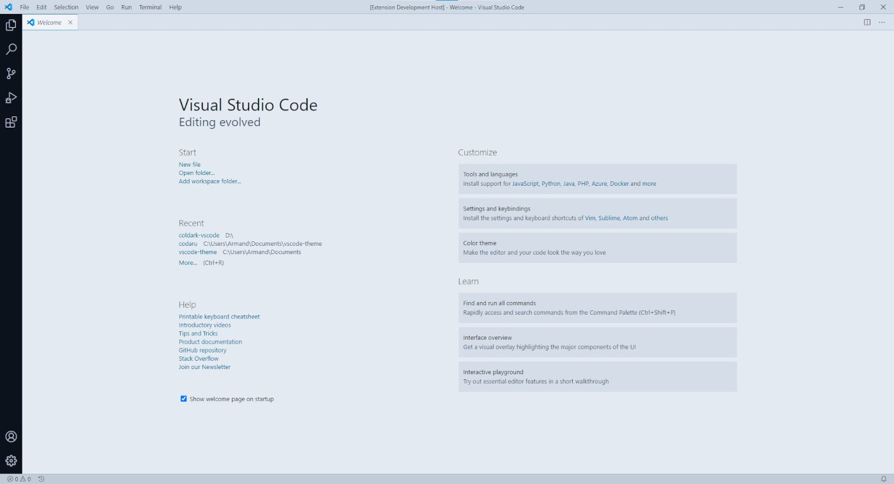
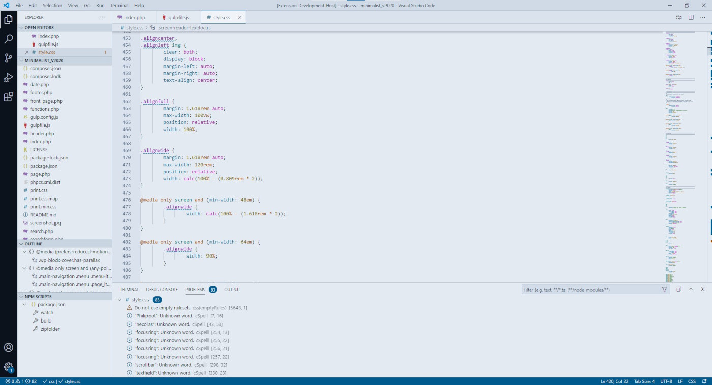
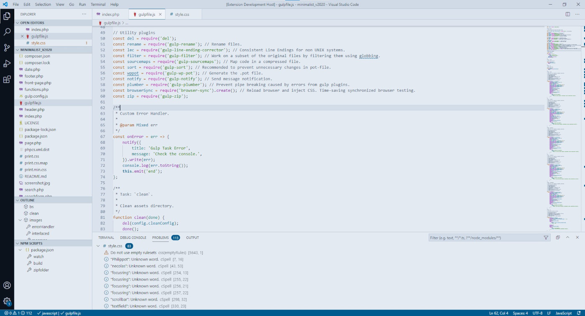
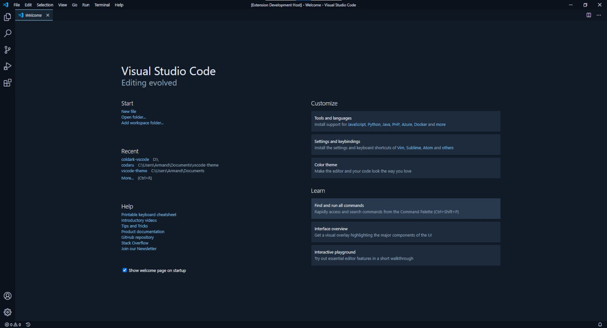
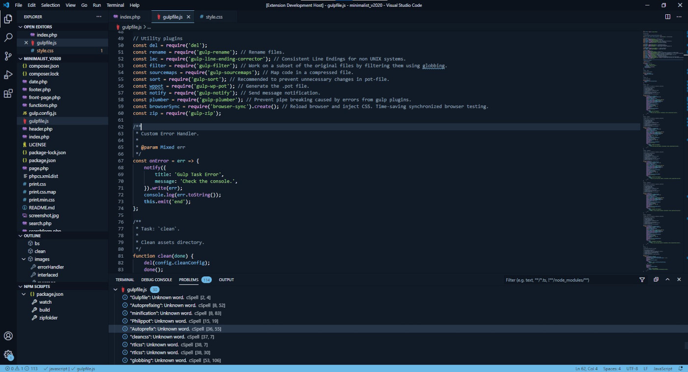

    

# Coldark - VS Code

    

An optimized theme for web development that comes with two versions: light & dark.

## Presentation

[Coldark](https://github.com/ArmandPhilippot/coldark/) is a gray-blue theme. The colors used respect the Web Content Accessibility Guidelines (WCAG) in order to provide sufficient reading comfort. However, with opacity, it is possible that some contrasts are diminished and that they are above level AA.

## Colors

Coldark consists of three color palettes. The first is common to both versions. The other two each apply to a version.

I tried to keep the same descriptions for both versions. However, for complex themes like VS Code, it doesn't work. So I separated the descriptions into 2 sections:

- Light Theme (Cold)
- Dark Theme (Dark)

### Light Theme

| Hex Code | Preview | Description | Denomination |
| :-: | :-: | --- | :-: |
| `#e3eaf2` | ![#e3eaf2][#e3eaf2] | **Default background** – Also used as foreground for Button & Badges. | `coldark00` |
| `#d0dae7` | ![#d0dae7][#d0dae7] | **Dark background** - Editor Gutter, Inputs, Line Highlight, Status bar (no folder), No tabs. Also used as foreground for Activity bar. | `coldark01` |
| `#8da1b9` | ![#8da1b9][#8da1b9] | **Selection background** - Code block, Secondary buttons, Some highlighting. Also used for Borders. | `coldark02` |
| `#3c526d` | ![#3c526d][#3c526d] | **Comments** - Invisible, Ignored, Placeholder. | `coldark03` |
| `#213043` | ![#213043][#213043] | **Light foreground** – Inputs, Status bar (no folder), Embedded modals & Widgets. | `coldark04` |
| `#111b27` | ![#111b27][#111b27] | **Default foreground** - Also used as Shadow and for most of Punctuation. | `coldark05` |
| `#0b121b` | ![#0b121b][#0b121b] | **Dark foreground** – Also used as background for Activity bar. | `coldark06` |
| `#f0f4f8` | ![#f0f4f8][#f0f4f8] | **Light background** – Tab active, Embedded modals, Widgets. | `coldark07` |
| `#006d6d` | ![#006d6d][#006d6d] | **Cyan** - Merge incoming content, Parameters, Tags, Support constant, CSS Variables, Markup inline raw, Punctuation Section Embedded (e.g. `<?php ?>`) | `coldark08` |
| `#755f00` | ![#755f00][#755f00] | **Yellow** - Modified, Hints, Integers, Boolean, Constants Language, Attribute Names, Shell Case Patterns, Markup Link URL | `coldark09` |
| `#005a8e` | ![#005a8e][#005a8e] | **Blue** - Badges, Buttons, Find Match, Info, Merge current content, Selection (outside editor), Status bar (folder open), Namespaces, Classes, Variables, Constants Other, Markup Headings, Property names | `coldark10` |
| `#116b00` | ![#116b00][#116b00] | **Green** - Added elements, Strings, CSS Colors, CSS Font names, Markup Link Text | `coldark11` |
| `#af00af` | ![#af00af][#af00af] | **Magenta** - Untracked elements, Token Expression value Support, Regular Expressions, Escape Characters, Constant Characters, Storage Modifiers, Instances, Markup List Punctuation, CSS values | `coldark12` |
| `#7c00aa` | ![#7c00aa][#7c00aa] | **Purple** - Unverified, Functions, CSS Classes & IDs | `coldark13` |
| `#a04900` | ![#a04900][#a04900] | **Orange** - Warnings, Status bar (debugging), Keywords, Storage, CSS Pseudo elements | `coldark14` |
| `#c70100` | ![#c70100][#c70100] | **Red** - Errors, Deleted, Invalids, Deprecated | `coldark15` |

### Dark Theme

| Hex Code | Preview | Description | Denomination |
| :-: | :-: | --- | :-: |
| `#111b27` | ![#111b27][#111b27] | **Default background** – Also used as foreground for Button & Badges. | `coldark00` |
| `#213043` | ![#213043][#213043] | **Light background** - Embedded modals, Widgets, Line Highlight, Tab active. | `coldark01` |
| `#3c526d` | ![#3c526d][#3c526d] | **Selection background** - Code block, Secondary buttons, Some highlighting. | `coldark02` |
| `#8da1b9` | ![#8da1b9][#8da1b9] | **Comments** - Invisible, Ignored, Placeholder. | `coldark03` |
| `#d0dae7` | ![#d0dae7][#d0dae7] | **Dark foreground** – Activity bar, Inputs, Status bar (no folder), Embedded modals & Widgets. | `coldark04` |
| `#e3eaf2` | ![#e3eaf2][#e3eaf2] | **Default foreground** - Also used for most of Punctuation. | `coldark05` |
| `#f0f4f8` | ![#f0f4f8][#f0f4f8] | **Light foreground** – Menu, Tab hover. | `coldark06` |
| `#0b121b` | ![#0b121b][#0b121b] | **Dark background** - Activity bar, Inputs, Status bar (no folder), Editor Gutter, No tabs. Also used for Borders. | `coldark07` |
| `#66cccc` | ![#66cccc][#66cccc] | **Cyan** - Merge incoming content, Parameters, Tags, Support constant, CSS Variables, Markup inline raw, Punctuation Section Embedded (e.g. `<?php ?>`) | `coldark08` |
| `#e6d37a` | ![#e6d37a][#e6d37a] | **Yellow** - Modified, Hints, Integers, Boolean, Constants Language, Attribute Names, Shell Case Patterns, Markup Link URL | `coldark09` |
| `#6cb8e6` | ![#6cb8e6][#6cb8e6] | **Blue** - Badges, Buttons, Find Match, Info, Merge current content, Selection (outside editor), Status bar (folder open), Namespaces, Classes, Variables, Constants Other, Markup Headings, Property names | `coldark10` |
| `#91d076` | ![#91d076][#91d076] | **Green** - Added elements, Strings, CSS Colors, CSS Font names, Markup Link Text | `coldark11` |
| `#f4adf4` | ![#f4adf4][#f4adf4] | **Magenta** - Untracked elements, Token Expression value Support, Regular Expressions, Escape Characters, Constant Characters, Storage Modifiers, Instances, Markup List Punctuation, CSS values | `coldark12` |
| `#c699e3` | ![#c699e3][#c699e3] | **Purple** - Unverified, Functions, CSS Classes & IDs | `coldark13` |
| `#e9ae7e` | ![#e9ae7e][#e9ae7e] | **Orange** - Warnings, Status bar (debugging), Keywords, Storage, CSS Pseudo elements | `coldark14` |
| `#f57a73` | ![#f57a73][#f57a73] | **Red** - Errors, Deleted, Invalids, Deprecated | `coldark15` |

## Screenshots

On Linux, the title bar and the menu are not customizable. The following screenshots were taken on Windows.

### Cold

| PHP | CSS | JS |
| --- | --- | --- |
|  |  |  |

### Dark

| PHP | CSS | JS |
| --- | --- | --- |
|  |  |  |

## Install

Coldark for VS Code can be installed via the extension manager by searching for "_Coldark_".

Coldark is available in the [VisualStudio Marketplace](https://marketplace.visualstudio.com/items?itemName=ArmandPhilippot.coldark) and in the [Open VSX Registry](https://open-vsx.org/extension/armandphilippot/coldark). So, you can install it in VS Code, Code - OSS and VSCodium.

## Disclaimer

- I tested the theme on Linux (Manjaro) and Windows, but not on Mac.
- I do not use all the features of VS Code: it is possible that some elements are not correctly incorporated within the theme.
- I have not tested the versions with all possible languages, only with those that I use commonly.
- The theme is still in active development. Some things may change over time.

I added a file named [UNUSED.md](https://github.com/ArmandPhilippot/coldark-vscode/blob/master/UNUSED.md) to specify the unused settings.

Tested with:

- HTML
- CSS / SCSS
- Javascript
- JSON
- PHP
- Markdown
- Bash script

## License

This project is open source and available under the [MIT License](https://github.com/ArmandPhilippot/coldark-vscode/blob/master/LICENSE).

<!-- REFERENCES -->

<!-- UI Colors -->

[#f0f4f8]: https://placehold.it/20/f0f4f8/000000?text=+
[#e3eaf2]: https://placehold.it/20/e3eaf2/000000?text=+
[#d0dae7]: https://placehold.it/20/d0dae7/000000?text=+
[#8da1b9]: https://placehold.it/20/8da1b9/000000?text=+
[#3c526d]: https://placehold.it/20/3c526d/000000?text=+
[#213043]: https://placehold.it/20/213043/000000?text=+
[#111b27]: https://placehold.it/20/111b27/000000?text=+
[#0b121b]: https://placehold.it/20/0b121b/000000?text=+

<!-- Syntax - Light Theme Colors -->

[#c70100]: https://placehold.it/20/c70100/000000?text=+
[#116b00]: https://placehold.it/20/116b00/000000?text=+
[#755f00]: https://placehold.it/20/755f00/000000?text=+
[#005a8e]: https://placehold.it/20/005a8e/000000?text=+
[#af00af]: https://placehold.it/20/af00af/000000?text=+
[#006d6d]: https://placehold.it/20/006d6d/000000?text=+
[#7c00aa]: https://placehold.it/20/7c00aa/000000?text=+
[#a04900]: https://placehold.it/20/a04900/000000?text=+

<!-- Syntax - Dark Theme Colors -->

[#f57a73]: https://placehold.it/20/f57a73/000000?text=+
[#91d076]: https://placehold.it/20/91d076/000000?text=+
[#e6d37a]: https://placehold.it/20/e6d37a/000000?text=+
[#6cb8e6]: https://placehold.it/20/6cb8e6/000000?text=+
[#f4adf4]: https://placehold.it/20/f4adf4/000000?text=+
[#66cccc]: https://placehold.it/20/66cccc/000000?text=+
[#c699e3]: https://placehold.it/20/c699e3/000000?text=+
[#e9ae7e]: https://placehold.it/20/e9ae7e/000000?text=+
