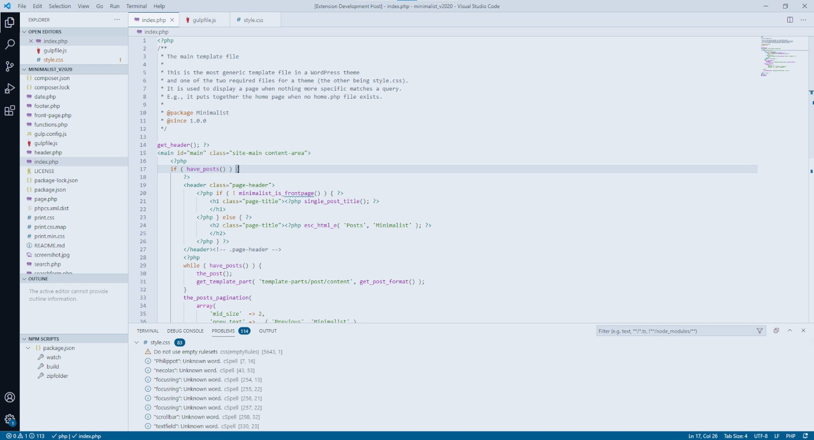
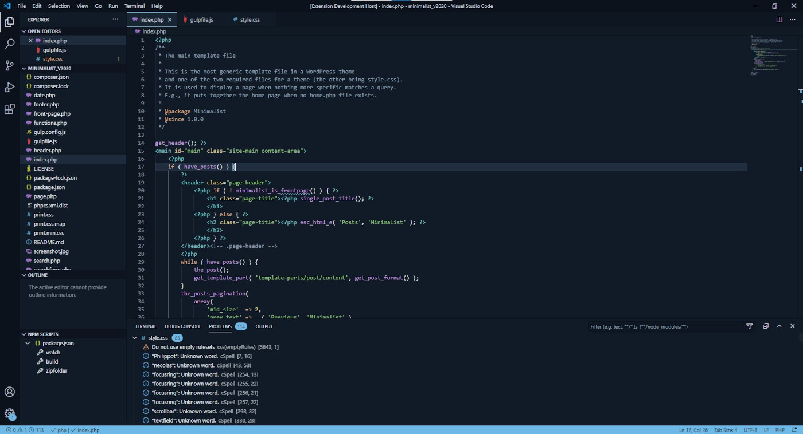

# Coldark

An optimized theme for web development that comes with two versions: light & dark.

## Presentation

Coldark are rather gray, blue & white. The dark theme is trying to be in compliance with WCAG rules. Some contrasts may not be enough. I was looking to make a theme that met my tastes above all. On the other hand, the light theme does not follow WCAG rules as much. It is difficult to follow these rules with syntax highlighting on light theme while keeping consistency between the two versions.

Tested with:

- HTML
- CSS / SCSS
- Javascript
- JSON
- PHP
- Markdown
- Bash script

## Platforms

Coldark is available for:

- [Visual Studio Code](https://marketplace.visualstudio.com/items?itemName=armandphilippot.coldark)

I do not use the other development environments so, for the moment, there are no other ports planned.

## Screenshots

These screenshots were taken on Linux. The title bar is not customizable on Linux, only on Windows (and maybe Mac). On Windows, the title bar fits properly to the theme (light for the light theme, dark for the dark theme). The activity bar is always dark.

### Cold

| HTML                                                                                   | SCSS                                                                                   | PHP                                                                                 |
| -------------------------------------------------------------------------------------- | -------------------------------------------------------------------------------------- | ----------------------------------------------------------------------------------- |
|  |  |  |

### Dark

| HTML                                                                                   | SCSS                                                                                   | PHP                                                                                 |
| -------------------------------------------------------------------------------------- | -------------------------------------------------------------------------------------- | ----------------------------------------------------------------------------------- |
|  |  |  |

## Install

Coldark can be installed via the VS Code extension manager by searching for "_coldark_".

## Participate

If you use languages other than those tested and if you notice an inconsistency in the syntax highlighting, you can submit an issue on Github.

If certain contrasts are not sufficiently pronounced, I am also listening to the critics. However, keep in mind that this is not a "_hight contrast_" theme, but a theme that seeks to be readable for the majority without accentuating the whole for others too much.

You are also free to suggest a port for your development environment.

In short, it is an open source project. You are free to create forks and make suggestions to improve it.

## Disclaimer

- I tested the theme on Linux (Manjaro) and Windows, but not on Mac.
- I do not use all the features of VS Code: it is possible that some elements are not correctly incorporated within the theme.
- I have not tested the versions with all possible languages, only with those that I use commonly.

## License

This project is open source and available under the [MIT License](https://github.com/ArmandPhilippot/coldark/blob/master/LICENSE).
